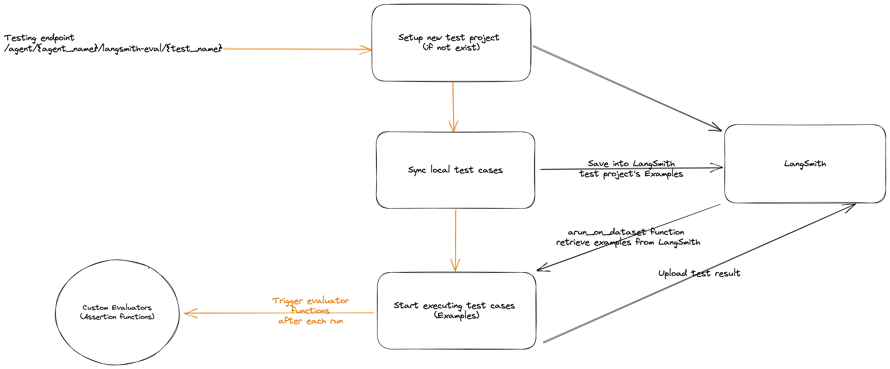

Zion provided a testing framework for running end-to-end testing for the LLM Agent. It built on top of [LangSmith's evalautions](https://docs.smith.langchain.com/evaluation)

## High Level Structure

## Datasets

The datasets are stored in the repository as the source of truth and will be synchronized into the test project's examples before the test executions.

## Test evaluators (Assertion function)

Defining the custom evaluators or use [LangChain off the shell evaluators](https://docs.smith.langchain.com/how_to_guides/evaluation/use_langchain_off_the_shelf_evaluators).
