# Baseline Pipeline Flow (Hades + Zion)

This guide walks through the end-to-end request path for the baseline TI-Bot Deep deployment. It maps every major hop—from the moment a caller hits the Zion API to the eventual retrieval from Hades and response synthesis—so engineers can trace behaviour and find the right modules quickly.

## High-Level Flow

```mermaid
flowchart LR
    User((User / Client)) -->|HTTP POST /agent/...| ZionAPI[FastAPI Router\n`baseline/zion/zion/main.py`]
    ZionAPI -->|Dispatch| ZionAgent[`ZionAgent`\n`baseline/zion/zion/agent/zion_agent.py`]
    ZionAgent -->|Selects graph| MultiAgent[LangGraph Workflow\n`multi_agent_workflow.py`]
    MultiAgent -->|Needs context?| ToolRouter{{Tool Router}}
    ToolRouter -->|Document question| HadesClient[`RagDocumentClient`\n`baseline/hades-kb-service/app/routes/doc_kb_route/handler.py`]
    ToolRouter -->|Non-doc tool| ExternalTool[Other Integrations\nSlack, Jira, etc.]
    HadesClient -->|REST call| HadesAPI[FastAPI Router\n`baseline/hades-kb-service/app/routes/api.py`]
    HadesAPI -->|Validate & queue| Ingestion[`handler.py` ingestion paths]
    Ingestion -->|Chunk & embed| Embedding[`RagDocumentClient.embed_document`]
    Embedding -->|Persist| PG[(Postgres + pgvector)]
    PG -->|Similarity search| HadesSearch[Search Helpers\n`handler.search_documents`]
    HadesSearch -->|Return matches| ZionAgent
    ExternalTool -->|Tool output| ZionAgent
    ZionAgent -->|LLM call| LLM[GrabGPT Chat Model\n`zion/agent/model.py`]
    LLM -->|Final answer| ZionAPI -->|HTTP Response| User
```

## Stage-by-Stage Breakdown

1. **Ingress (Zion FastAPI)**  
   Requests hit the Zion FastAPI app declared in [`baseline/zion/zion/main.py`](../baseline/zion/zion/main.py). Middleware performs JWT parsing, tracing, and request logging before routing to `/agent/...` handlers.

2. **Agent Orchestration (ZionAgent)**  
   [`ZionAgent`](../baseline/zion/zion/agent/zion_agent.py) chooses between LangChain ReAct agents and the LangGraph multi-agent workflow defined in [`multi_agent_workflow.py`](../baseline/zion/zion/agent/multi_agent/multi_agent_workflow.py). It packages chat history, available tools, and guardrails before invoking the workflow.

3. **Tool Routing (Multi-Agent Nodes)**  
   Within the graph, the categoriser node decides whether the turn needs external knowledge. Document queries call the `RagDocumentTool`, which hits the Hades knowledge base; other paths activate integrations such as Slack history or custom plugins.

4. **Hades API Surface**  
   Zion uses the `RagDocumentClient` helper in [`doc_kb_route/handler.py`](../baseline/hades-kb-service/app/routes/doc_kb_route/handler.py) to call Hades endpoints published in [`app/routes/api.py`](../baseline/hades-kb-service/app/routes/api.py). Secrets and request validation happen here before work is dispatched.

5. **Ingestion & Search Workflows**  
   Hades normalises text, chunks content with LangChain splitters, embeds via Azure OpenAI (see [`app/models/azure_openai_model.py`](../baseline/hades-kb-service/app/models/azure_openai_model.py)), and writes embeddings plus metadata into Postgres/pgvector via [`RagDocumentDbClient`](../baseline/hades-kb-service/app/core/ragdocument_db/client.py).

6. **Result Assembly**  
   Search handlers collect similarity matches, attach document metadata, and stream structured JSON back to Zion. Zion then blends tool outputs, applies token optimisation helpers (`zion/util/optimize_token.py`), and delegates final wording to the GrabGPT chat model before replying to the caller.

## Trace It Yourself

To debug a request end-to-end:

- **Start at Zion:** set breakpoints in `zion/main.py` or enable FastAPI logging to observe inbound payloads.
- **Follow tool invocations:** log the tool decisions inside `multi_agent_workflow.py` to confirm when Hades is called.
- **Inspect Hades processing:** use structured logs around `RagDocumentClient` and `RagDocumentDbClient` to see chunking, embedding, and SQL queries.
- **Close the loop:** confirm the final chat turn in `ZionAgent._execute_agent` and verify the response sent back through FastAPI.

This diagram and checklist provide a consistent reference when onboarding new contributors, tuning the pipeline, or diagnosing retrieval issues.
